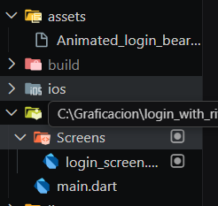

# 🐻 Login with Rive Animation

An interactive Flutter login application featuring a charming animated bear character powered by Rive animations. The bear responds dynamically to user interactions, creating an engaging and delightful login experience.

---
## ✨ Features

- 🎭 **Interactive Rive Animation**: Animated bear character that responds to user input
- 📧 **Email Input Field**: Clean and intuitive email entry
- 🔒 **Password Input Field**: Secure password entry with visibility toggle
- 👁️ **Password Visibility Toggle**: Show/hide password functionality
- 🎨 **Modern UI Design**: Beautiful Material Design 3 interface with smooth animations
- 📱 **Responsive Layout**: Adapts to different screen sizes

---

## 🎬 What is Rive?

**Rive** is a powerful real-time interactive design and animation tool that allows designers and developers to create stunning, interactive graphics that run anywhere. Unlike traditional animation formats, Rive animations are rendered in real-time, which means they are incredibly lightweight and can respond to user interactions, making them perfect for creating engaging user experiences.

---

### 🤖 What is a State Machine?

A **State Machine** in Rive is a powerful feature that enables animations to react to user input and app logic in real-time. It allows you to define different states (like "idle", "looking", "success", "fail") and transitions between them based on triggers or conditions. This makes it possible to create dynamic, interactive animations that respond to user behavior, such as:

- The bear tracking the user's cursor
- Showing different expressions based on login success/failure
- Reacting to text input in real-time

State Machines make animations feel alive and responsive rather than just playing predetermined sequences.

---

## 🛠️ Technologies

- **Flutter** `^3.10.8` - UI framework for building natively compiled applications
- **Dart** - Programming language optimized for building mobile, desktop, and web apps
- **Rive** `^0.13.20` - Real-time interactive design and animation tool
- **Material Design 3** - Modern design system for creating beautiful UIs
- **Cupertino Icons** `^1.0.8` - Icon library

---

## 📁 Project Structure




----

### 📄 Main Files Description

- **`main.dart`**: The entry point of the application. Sets up the MaterialApp with Material Design 3 theme and routes to the LoginScreen.

- **`login_screen.dart`**: Contains the main login UI with:
  - Rive animation widget displaying the animated bear
  - Email TextField with icon and border styling
  - Password TextField with visibility toggle functionality
  - Responsive layout using MediaQuery

---

## 🎥 Demo


_The animated bear reacts to user interactions, creating an engaging login experience_


---

## 📚 Course Information

**Subject:** 🎨 Graficación  
**Professor:** 👨‍🏫 RODRIGO FIDEL GAXIOLA SOSA


---

## 🎨 Credits

Animation created by the talented designers at Rive. Check out the original animation and more amazing content:
- 🔗 [Rive Community Files](https://rive.app/community/)
- 🐻 Original Bear Animation: [Login Animation Bear](https://rive.app/community/files/2432-4873-animated-login-screen/)

---

## 🚀 Getting Started

### Prerequisites

- Flutter SDK (3.10.8 or higher)
- Dart SDK
- Android Studio / VS Code
- An emulator or physical device

---

### Installation

1. Clone the repository
```bash
git clone <your-repository-url>
cd login_with_rive_animation
```

2. Install dependencies
```bash
flutter pub get
```

3. Run the application
```bash
flutter run
```

---

## 📱 Supported Platforms

- ✅ Android
- ✅ iOS
- ✅ Web
- ✅ Windows
- ✅ macOS
- ✅ Linux

## 📄 License

This project is for educational purposes as part of the Graficación course.

---

Made with ❤️ using Flutter and Rive
