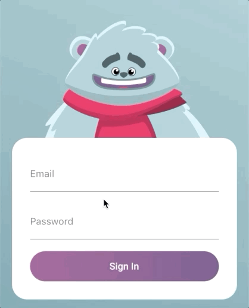

# 🎨 Login with Rive Animation

A polished Flutter login screen featuring interactive Rive animations that make your authentication UI feel alive. The character reacts to focus changes, typing, and validation results for a more engaging experience.

---

## 📱 Features

- 🎭 **Interactive Rive Animation**: A character driven by a Rive State Machine that responds to user interactions.
- 👤 **Email / Username Input**: Text field with an email icon.
- 🔐 **Password Input**: Secure password field with a lock icon.
- 👁️ **Password Visibility Toggle**: Show/hide the password while typing.
- ✅❌ **Login Success/Fail Feedback**: Fires `trigSuccess` / `trigFail` based on validation.
- 🧠 **Look Tracking While Typing**: `numLook` updates according to the email length and returns to neutral after a short debounce.
- 🙈 **Hands Up on Password Focus**: `isHandsUp` toggles when the password field is focused.
- ⚠️ **Inline Validation Errors**: Shows `errorText` for invalid email/password input.
- 📜 **Scrollable Layout**: Uses `SingleChildScrollView` to prevent overflow on small screens.
- 🎨 **Modern UI Extras**: “Forgot password?” and “Sign up” actions + a styled Login button.
- 📐 **Responsive Design**: Uses `MediaQuery`.
- 🧹 **Clean App UI**: `debugShowCheckedModeBanner: false`.

---

## 🆕 Latest Updates (2026-03-10)

From commit: **`feat(login): add success/fail triggers with email and password regex validation`**

- 🧾 Added `TextEditingController`s for email and password.
- 🧪 Added regex validation:
  - 📧 **Email**: basic `name@domain.tld` format check.
  - 🔒 **Password**: at least 8 characters with **uppercase**, **lowercase**, **digit**, and a **special character**.
- 🎛️ Added `_onLogin()` which:
  - ⚠️ Updates UI errors (`emailError`, `passError`).
  - ⌨️ Dismisses the keyboard and resets animation states.
  - ✅ Fires `trigSuccess` or ❌ `trigFail` depending on validation.

---

## 🎬 What is Rive and a State Machine?

### 🎯 Rive

**Rive** is a real-time interactive design and animation tool used to create vector animations that are:

- 🎮 Interactive and responsive to input
- 📦 Lightweight at runtime
- 🔄 Controlled through State Machines
- 🌐 Cross-platform compatible

---

### 🤖 State Machine

A **State Machine** in Rive controls animation states and transitions. In this project it is used to:

- 🔀 Switch between states like *idle*, *success*, and *fail*
- 🎭 React to focus/typing events (`isChecking`, `isHandsUp`)
- ⚡ Trigger specific animations based on login validation

---

## 🛠️ Technologies

- 🐦 **Flutter** `^3.10.8`
- 🎯 **Dart**
- 🎞️ **Rive** `^0.13.20`
- 🎨 **Material Design 3**

---

## 📁 Project Structure


```text
lib/
├── main.dart                    # App entry point / MaterialApp configuration
└── Screens/
    └── login_screen.dart        # Login screen with Rive animation + form logic
```

---

## 🎥 Demo



---

## 🚀 Getting Started

### ✅ Prerequisites

- Flutter SDK (3.10.8 or higher)
- Dart SDK
- VS Code / Android Studio
- An emulator or physical device

---

### 📦 Installation

1. Clone the repository
```bash
git clone https://github.com/EyesLight6/login_with_rive_animation.git
cd login_with_rive_animation
```

2. Install dependencies
```bash
flutter pub get
```

3. Run the app
```bash
flutter run
```

---

## 📱 Supported Platforms

- ✅ Android
- ✅ iOS
- ✅ Web
- ✅ Windows
- ✅ macOS
- ✅ Linux

---

## 📄 License

This project is created for educational purposes.

---

Made with ❤️ using Flutter and Rive